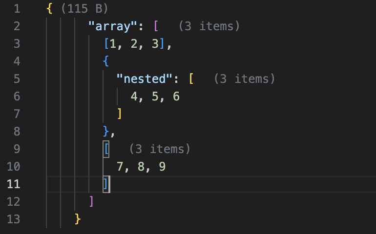

# JSON Array Length

在 JSON 文件中显示折叠数组的长度和文件大小的 VS Code 扩展。

## 功能特点

- 自动显示折叠数组的长度
- 在文件头部显示文件大小
- 实时更新统计信息
- 完美集成到 VS Code 界面

## 使用方法

1. 打开任意 JSON 文件
2. 折叠数组后会自动显示数组长度
3. 文件顶部会显示当前文件大小

## 示例

## 更新日志

### 0.0.1

- 初始版本发布
- 支持数组长度显示
- 支持文件大小显示

## 问题反馈

如果您发现任何问题或有建议，请在 [GitHub Issues](https://github.com/kongtaoxing/json-len/issues) 上提出。

## 许可证

MIT
