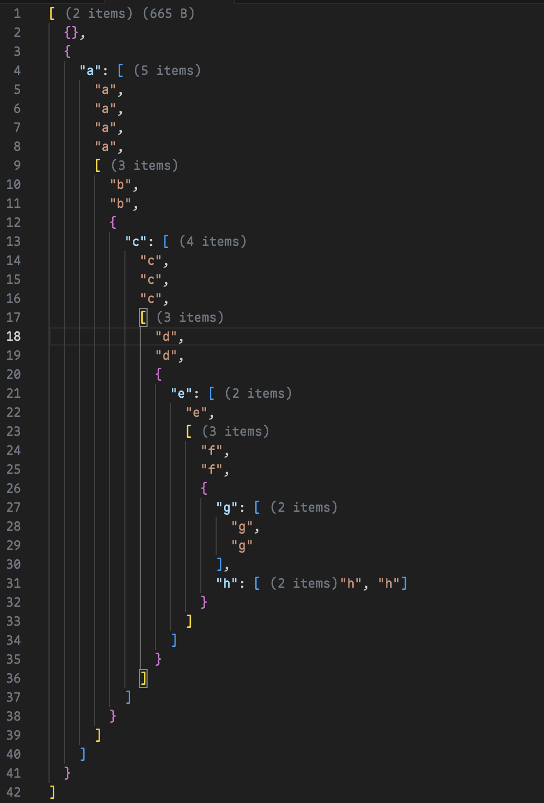

# JSON Array Length

A VS Code extension that displays the length of folded arrays and file size in JSON files. 中文版 README 在[这里](./README.zh-CN.md)。

## Features

- Automatically displays the length of folded arrays
- Shows file size at the top of the file
- Real-time statistics updates
- File size threshold limit, prompting users whether to render when files are too large (default 100Mb) to prevent performance impact
- JSON beautification with preview support
  - Use the "Beautify Preview" button to format any JSON file with a side-by-side preview
  - For single-line complex JSON files, automatic detection and formatting suggestions will be provided

## Usage

1. Open any JSON file
2. Array lengths will be automatically displayed when collapsed
3. File size will be shown at the top of the file
4. Click the "Beautify Preview" button in the editor to format JSON with preview
5. For single-line complex JSON files, you'll receive a prompt to format for better readability

## Examples

### Usage Example

### File Size Threshold Settings

### Beautify Preview

before:

formating:

formated:

## Changelog

See [ChangeLog](./CHANGELOG.md)

## Issues

If you find any issues or have suggestions, please raise them in [GitHub Issues](https://github.com/kongtaoxing/json-len/issues).

## License

MIT
