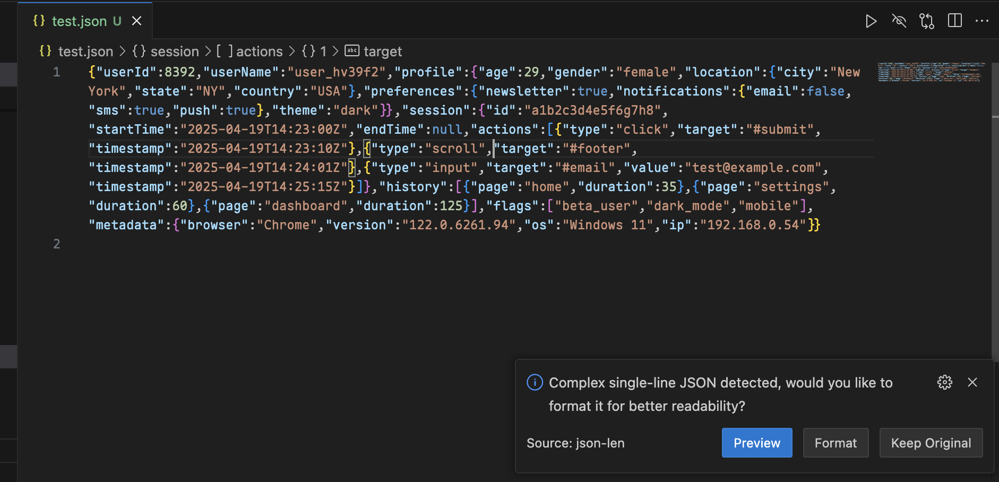
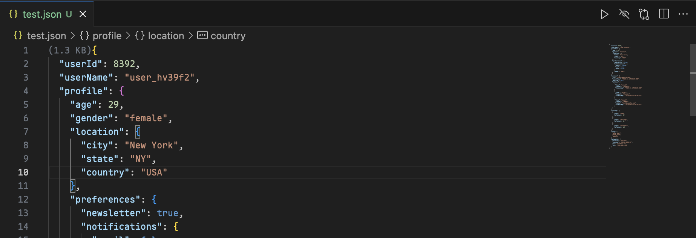

# JSON Array Length

在 JSON 文件中显示折叠数组的长度和文件大小的 VS Code 扩展。

## 功能特点

- 自动显示折叠数组的长度
- 在文件头部显示文件大小
- 实时更新统计信息
- 文件大小阈值限制，文件过大（默认100Mb）则提醒用户是否渲染，防止影响性能
- JSON 美化预览功能
  - 通过"Beautify Preview"按钮（Ctrl+Shift+P 或 Command+Shift+P）可以对任意 JSON 文件进行格式化并预览
  - 对于单行的复杂 JSON 文件，会自动检测并提供格式化建议

## 使用方法

1. 打开任意 JSON 文件
2. 折叠数组后会自动显示数组长度
3. 文件顶部会显示当前文件大小
4. 点击编辑器中的"Beautify Preview"按钮（Ctrl+Shift+P 或 Command+Shift+P）可以格式化 JSON 并预览
5. 对于单行的复杂 JSON 文件，会收到格式化提示以提高可读性

## 示例

### 使用示例

### 文件大小阈值限制

### 美化预览

格式化前:

格式化中:

格式化后:

## 更新日志

见 [ChangeLog](./CHANGELOG.md)

## 问题反馈

如果您发现任何问题或有建议，请在 [GitHub Issues](https://github.com/kongtaoxing/json-len/issues) 上提出。

## 许可证

MIT 